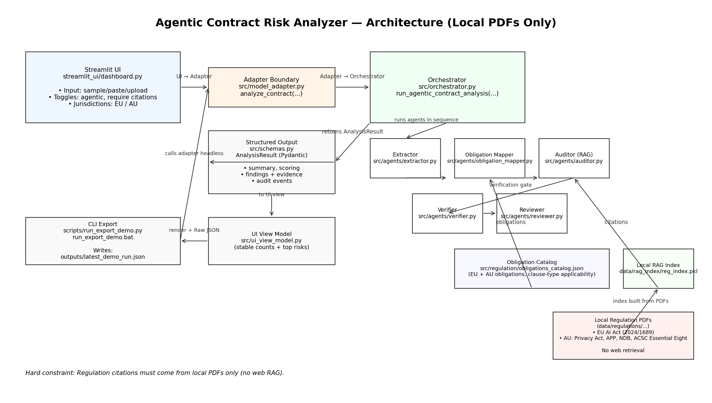

# Architecture (Hiring Manager View)

This is a production-style architecture with a **stable adapter boundary**, strict output schemas, and a multi-agent pipeline grounded on **local regulation PDFs only**.

## What to notice

- **Stable integration boundary:** UI depends only on `analyze_contract(...)` and `AnalysisResult`.
- **Multi-agent separation of concerns:** Extract → Map → Audit (Local RAG) → Verify → Review.
- **Auditability:** Findings include evidence + citations (when enabled) and an audit trail.
- **Local-PDF-only constraint:** No web retrieval is used for regulation citations.
